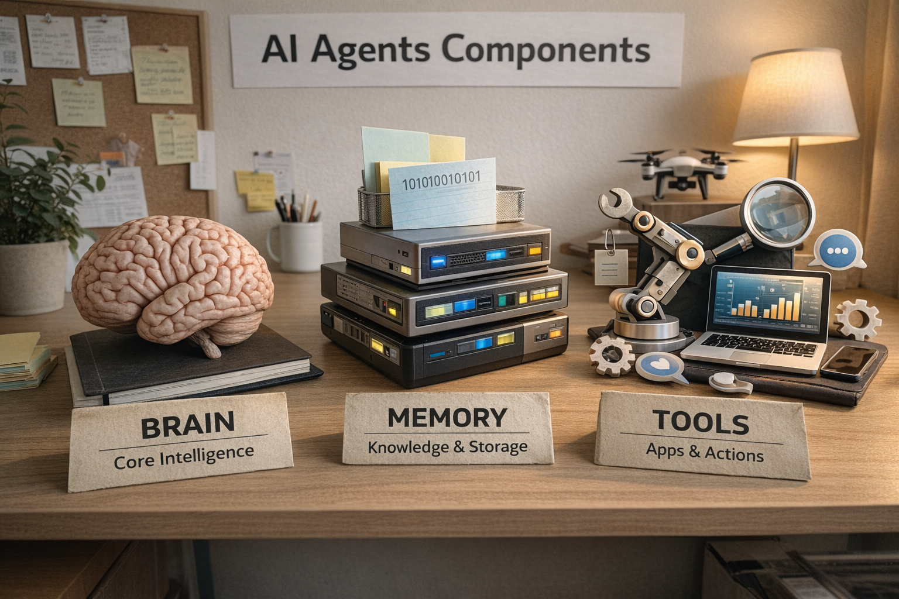

# Leveraging AI – AI Agents

## Understanding What is an AI Agent
An AI Agent is a software entity designed to perform tasks within a defined scope by perceiving information, reasoning over it, and taking actions toward achieving specific goals, often mimicking how a human would approach the same task.

Unlike traditional automations that follow a sequence of instructions, an AI Agent can:
- Understand inputs
- Make decisions based on goals and constraints
- Take actions to complete tasks
- Adapt its behaviour based on outcomes

## Components of an AI Agent
Everything an AI Agent can do is derived from how humans would do the same task.

Let us take an example of a Stone Age hunter. They used their **brain** to decide where to hunt, from their **memory** they recall the animal locations and safe food sources, and they used **tools** like spears or traps to capture prey.

Similarly, we can divide an AI Agent into 3 components:

### 1. Brain
This is the intelligence layer of the AI Agent, usually powered by LLM models (GPT, Claude, etc.).

**Function – Decision Making**

It decides:
- What to do next
- Which tool to use
- How to interpret user inputs
- How to generate responses

### 2. Memory
Memory allows the AI Agent to retain information across interactions.

**Types of Memory**
- Short-term memory: Conversation context, recent actions
- Long-term memory: Stored knowledge, embeddings, databases
- Session memory: Task-specific information during execution

### 3. Tools
Tools allow the agent to interact with the external world.

**Examples**
- APIs
- Databases
- Search engines
- Code execution
- Email / Slack / CRM integrations
- File processing systems

Tools convert decisions into real-world actions.

## Human Example: A Personal Assistant Booking Travel

Imagine a human assistant responsible for booking your business travel.

### Brain (Reasoning)
The assistant:
- Understands your request: “Book a flight to Delhi tomorrow morning”
- Decides the best options based on time, cost, and preferences
- Chooses which steps to perform next

### Memory
The assistant remembers:
- Preferred airline
- Past travel history
- Passport details
- Seating preferences

### Tools
The assistant uses:
- Airline booking websites
- Payment systems
- Email to send tickets
- Calendar to block dates

These three components define what an agent is, while orchestration and context management define how the agent operates in real systems.

---

## The Fourth Component: Orchestrator
Now that we understand the three core components of an AI Agent Brain, Memory, and Tools, there must also be a mechanism that ensures smooth communication between them. These components need to work together in the correct sequence, exchange data reliably, and coordinate actions across multiple steps.

This is where the Orchestrator comes into play. Orchestrator frameworks such as LangChain, LlamaIndex, or Agno manage the interaction between the agent’s reasoning model, memory systems, and external tools. They handle workflows, tool selection, state management, and execution flow, ensuring the agent can perform complex tasks in a structured and reliable manner.

In simple terms:
- Brain thinks  
- Memory remembers  
- Tools act  
- Orchestrator coordinates everything

## How Frameworks Work – General Idea

Once you understand these basics you can create your own framework as well.

### Context Management
Most AI agent frameworks operate based on the context provided to the LLM, as the quality of decisions largely depends on the information included in each request.

- A **system prompt** defines the agent’s role and behaviour
- **Conditional prompts** are added only when certain conditions are met
- **Pre-tool prompts** provide tool-specific instructions
- **Post-tool prompts** validate results and guide next actions

Effective orchestration decides which prompts are always present and which are conditional, ensuring both efficiency and accurate reasoning.

---

## Retrieval-Augmented Generation (RAG): Extending Agent’s Knowledge

In Retrieval-Augmented Generation (RAG), an agent first 

1. Retrieves relevant information from external knowledge sources  
2. Adds that information to the prompt  
3. Generates a grounded response using the LLM  

This reduces hallucinations and enables responses based on real organizational data.

---

## Common Use Cases of RAG

### 1. Enterprise Knowledge Assistants
Employees can ask questions about:
- Company policies
- Internal documentation
- SOPs
- Technical manuals

### 2. Customer Support Automation
Agents can:
- Search product manuals
- Retrieve troubleshooting guides
- Pull service documentation
- Provide document-backed responses

### 3. Legal and Compliance Search
RAG systems help professionals:
- Search contracts
- Retrieve clauses
- Summarize legal documents
- Answer compliance-related questions

---

## How Retrieval Works: Search Methods

Before an AI agent can generate grounded responses using RAG, it must first retrieve the most relevant information. This retrieval step relies on different search techniques, each designed to identify relevant knowledge in different ways.

There are three main search methods used:

### 1. Keyword Search (Lexical)
- BM25 / TF-IDF
- Exact word matching

### 2. Semantic Search (Vector)
- Embedding similarity
- Meaning-based retrieval

### 3. Hybrid Search
- Combines keyword + semantic search
- Used in most production systems

Let us see how to use the most efficient search Hybrid Search correctly.

## Hybrid Search Optimization

Hybrid Search needs optimization to work well in production RAG systems. Otherwise, either keyword search dominates or semantic search returns loosely relevant results.

### 1. Weighted Score Fusion

Combine lexical and semantic scores using weights:
- Final Score = (α × Semantic Score) + (β × Keyword Score)

Adjust weights depending on the use case:
- More semantic weight → conceptual queries
- More keyword weight → exact identifiers (IDs, error codes, names)

This is one of the most common optimization methods.

### 2. Query-Type Routing

Detect the query type and dynamically adjust retrieval:

- “Error code 504 fix” → prioritize keyword search
- “How to improve latency?” → prioritize semantic search

Simple query classification significantly improves accuracy.

### 3. Re-ranking (Cross-Encoder / LLM Reranking)

Retrieve top N results using hybrid search, then:

- Re-rank results using a cross-encoder model or LLM
- Select the most contextually relevant chunks

This greatly improves final retrieval quality.

### 4. Chunk Optimization

Hybrid search performs poorly if chunks are poorly structured.

Optimize:
- Chunk size (too large → noisy, too small → fragmented)
- Add metadata (titles, sections, tags)
- Use hierarchical chunking

Better chunking dramatically improves both keyword and semantic retrieval.

### 5. Metadata Filtering

Apply filters before scoring:

- document_type
- date range
- department
- language

This reduces noise and improves ranking accuracy.

---

## Production-Grade AI Agent

### What makes an AI Agent Production Grade?

A production-grade AI agent is not defined only by its intelligence, but by its reliability, accuracy, efficiency, and consistency when performing real-world tasks at scale. Such agents must be capable of executing expected workflows with minimal hallucination, controlled error margins, and predictable behaviour across varying inputs and environments.

### Ensuring the Agent is Production-Grade

### 1. LLM Configuration

In addition to prompts and retrieval strategies, configuring LLM runtime parameters plays a critical role in agent reliability. Settings such as temperature, top-p sampling, token limits, and repetition penalties directly influence response determinism, creativity, and cost efficiency. Proper parameter tuning ensures that agents behave consistently across different workflows while maintaining the flexibility required for complex reasoning tasks.
-	**Temperature**

Controls randomness.

    Lower → deterministic, factual responses

    Higher → creative, exploratory responses

Different workflows should use different configurations:

    -	Tool calling → low temperature
    -	Reasoning tasks → medium temperature
    -	Creative generation → higher temperature

- **Top-p (nucleus sampling)**

Top-p limits token selection to the smallest set of tokens whose cumulative probability reaches a specified threshold, filtering out low-probability options. Lower values produce more focused, deterministic outputs, while higher values increase diversity.

- **Max tokens**

Limits response length and cost.
- Stop sequences

Ensures structured outputs and controlled completion.

- Frequency / presence penalties

Helps reduce repetition and improve diversity.

### 2. Strong Constraints and Guardrails

Production-grade AI agents must operate within clearly defined boundaries to ensure reliability, safety, and predictable execution. Constraints and guardrails enforce structured workflows, reduce hallucinations, and prevent unsafe or unauthorized actions.

- **Workflow enforcement:** Ensures the agent follows predefined execution steps rather than taking arbitrary reasoning paths, improving consistency and reliability.
- **Tool-first reasoning:** Encourages the agent to rely on verified tools or data sources before generating responses, reducing unsupported or fabricated outputs.
- **Output schema validation:** Forces responses to follow structured formats (e.g., JSON schemas), enabling downstream systems to safely consume the output and detect malformed responses.
- **Security policies:** Applies rules that restrict sensitive data access, prevent prompt injection risks, and ensure compliance with operational policies.
- **Restricted tool permissions:** Limits which tools an agent can access and under what conditions, preventing misuse or unintended operations.

Together, these guardrails ensure that the agent performs tasks within controlled boundaries, significantly reducing hallucinations, operational errors, and security risks while maintaining production reliability.

### 3. Robust User Input Parsing

Production-grade AI agents must correctly interpret and sanitize user inputs before initiating reasoning or tool execution. Robust input parsing ensures that requests are clean, structured, and safe, reducing the risk of incorrect actions or security issues.

- **Input validation:** Ensures inputs follow expected formats and required fields.
- **Intent detection:** Identifies the user’s objective to route the request to the correct workflow.
- **Structured parsing:** Converts unstructured text into structured parameters for accurate tool calls.
- **Error handling:** Requests clarification when inputs are incomplete or ambiguous.
- **Injection protection:** Filters malicious instructions to prevent prompt injection or unsafe behaviour.

Together, these mechanisms ensure the agent receives validated, structured, and secure inputs, improving reliability and execution accuracy.

---

## Standard Production Engineering Practices

### 4. Evaluation and Monitoring
- Success metrics
- Hallucination tracking
- Human feedback loops
- Observability

### 5. Cost and Latency Optimization
- Model routing
- Caching
- Response truncation
- Efficient retrieval

### 6. Reliability and Fallback Handling
- Retry logic
- Model fallback
- Safe default responses
- Tool failure handling

---

A modern AI agent is not just a language model, but a coordinated system consisting of reasoning engines, memory layers, external tools, orchestration frameworks, retrieval pipelines, and production reliability mechanisms. When these layers are designed together, AI agents evolve from experimental prototypes into dependable systems capable of performing real-world tasks at scale.
